# vsdRiscvSoc
All the projects/assignments done as part of India RISC-V Chip Tapeout workshop conducted by VSD. 

## Table of Contents

* [Task1 - RISC-V Toolchain Setup Tasks & Uniqueness Test](#task1---risc-v-toolchain-setup-tasks--uniqueness-test)
    * [End Goal](#end-goal)
    * [File Used for Uniqueness Test](#file-used-for-uniqueness-test)
    * [Command used for compliation](#command-used-for-compliation)
    * [Output Received](#output-received)
    * [Installation of RISC-V toolchain, spike and pk.](#installation-of-risc-v-toolchain-spike-and-pk)
        * [Step1: Install riscv toolchain](#step1-install-riscv-toolchain)
	    * [Step2: Install Device Tree Compiler (DTC)](#step2-install-device-tree-compiler-dtc)
	    * [Step3: Install spike and add to path](#step3-install-spike-and-add-to-path)
	    * [Step4: Install pk and add to path](#step4-install-pk-and-add-to-path)
	    * [Step5: Sanity checks](#step5-sanity-checks)
	* [Uniqueness Test](#uniqueness-test)
	* [Errors encountered during the installation](#errors-encountered-during-the-installation)
   * [Task 2 - Prove Your Local RISC-V Setup (Run, Disassemble,Decode)](task2/#task-2---prove-your-local-risc-v-setup-run-disassembledecode)
   		* [End Goal](task2/#end-goal)
		* [Spike Version used](task2/#spike-version-used)
		* [Uniqueness mechanism](task2/#uniqueness-mechanism)
		* [Programs implemented](task2/#programs-implemented)
		    * [Factorial](task2/#factorial)
		    * [Max Array](task2/#max-array)
		    * [Bitops](task2/#bitops)
		    * [Bubble sort](task2/#bubble-sort)
			* [Final folder contents](task2/#after-executing-all-the-above-programs-your-final-folder-will-look-like-this)

  


# Task1 - RISC-V Toolchain Setup Tasks & Uniqueness Test

## End Goal: 
To Install RICV-V Toolchain, install spike and pk, and do a uniqueness test.

## File Used for Uniqueness Test: 
unique_test.c: [task1/files/unique_test.c](task1/files/unique_test.c)

## Command used for compliation: 
```bash
riscv-none-elf-gcc -O2 -Wall -march=rv64ima -mabi=lp64 -DUSERNAME=\"Jahnavi\" -DHOSTNAME=\"VLSILab\" unique_test.c -o unique_test
```

## Output Received: 

```bash
RISC-V Uniqueness Check 
User: Jahnavi
Host: VLSILab
UniqueID: 0x69b7e1cc91ae1a87
GCC_VLEN: 6
```
Task1 Output: 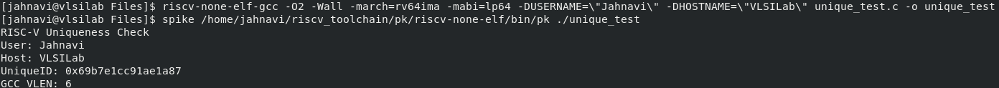


## Installation of RISC-V toolchain, spike and pk. 

OS used: Alma Linux

Follow the below steps for installing RICV-V Toolchain, spike and pk for **Alma Linux Operating System**.

### Step1: Install riscv toolchain
#### Install xpm packages: To ensure all the required libraries are installed. 
XPM packages, abbreviated as xPacks, are versatile, language-neutral software packages coming from  [https://xpack-dev-tools.github.io](https://xpack-dev-tools.github.io). xPack GNU RISC-V Embedded GCC packages help in easy installation without worrying about dependent libraries. These packages will automatically update the libraries as well when the system updates happen. More details on this can be found in the above link. 
 
##### Prerequisites for xpm 
The only prerequisite for xPack is a recent version of Node.js (>=18.0.0), as some dependencies require new features. So first checking the version available. 

```bash
node --version
```

 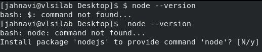


To get the latest version run the script given in the same above website (also attached in the folder [task1/files/install-nvm-node-npm-xpm.sh](task1/files/install-nvm-node-npm-xpm.sh). This will also install latest npm and xpm packages. 
```bash
mkdir -pv "${HOME}/Downloads/"
curl --output "${HOME}/Downloads/install-nvm-node-npm-xpm.sh" https://raw.githubusercontent.com/xpack/assets/master/scripts/install-nvm-node-npm-xpm.sh
cat "${HOME}/Downloads/install-nvm-node-npm-xpm.sh"
```

 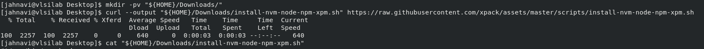
 After downlaoding run the sript. 
```bash
bash "${HOME}/Downloads/install-nvm-node-npm-xpm.sh"
exit
```
The last line of the script will give the version: 

 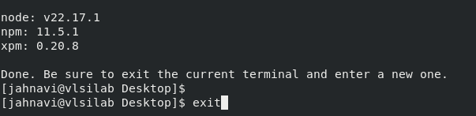

You can exit this terminal and check in a new terminal whether xpm has been installed. 

```bash
which xpm
xpm --version
```
 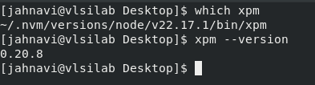


#### Install riscv-none-elf-gcc (riscv toolchain) 

This is a prebuilt toolchain taken from [https://www.npmjs.com/package/@xpack-dev-tools/riscv-none-elf-gcc](https://www.npmjs.com/package/@xpack-dev-tools/riscv-none-elf-gcc). To download it, initialize xpm and download the riscv-none-elf-gcc
 
We need to ensure that .json file is available in your project folder for xpm to work. So make one folder for your project and initialize xpm there

```bash
cd /home/jahnavi
mkdir riscv_toolchain
cd riscv_toolchain
xpm init
```

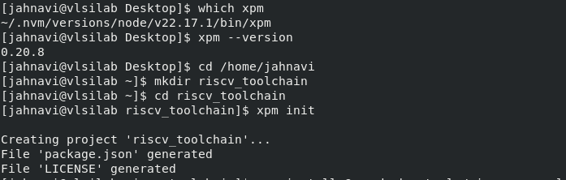

Install the latest package:

```bash
xpm install @xpack-dev-tools/riscv-none-elf-gcc@latest --verbose
```

 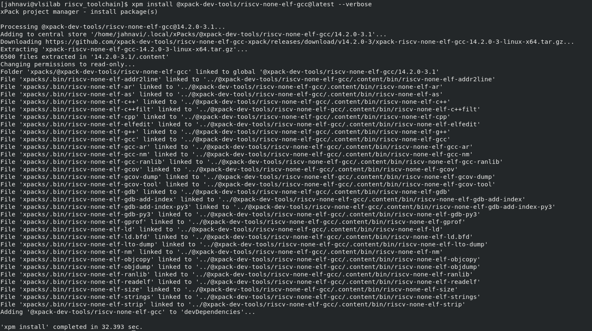


List all the files downloaded
```bash
ls -l xpacks/.bin
```
 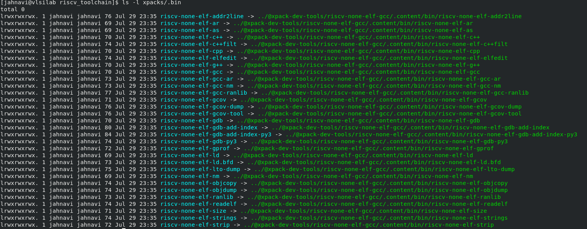

#### Add to path 
For the GCC and other binaries to be available without always calling using their path we need to add them to your shell path. The following command adds to the path:
```bash
export PATH=/home/jahnavi/riscv_toolchain/xpacks/.bin:$PATH
```
But this will only be available in the current shell. Once you close and open the terminal this will go away. Therefore we need to save it to *~/.bashrc* file. (Here ~/ indicates home path) The following is the command for it:
```bash
echo 'export PATH=/home/jahnavi/riscv_toolchain/xpacks/.bin:$PATH' >> ~/.bashrc
source ~/.bashrc
```
 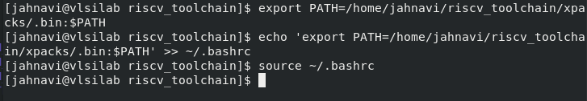
 
 
**Riscv Installation Completed.**

Sanity Check:

```bash
which riscv-none-elf-gcc
```
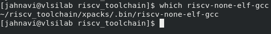

Checking version:

```bash
~/.local/xPacks/riscv-none-elf-gcc/xpack-riscv-none-elf-gcc-14.2.0-3/bin/riscv-none-elf-gcc --version
```
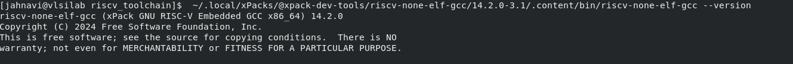

### Step2: Install Device Tree Compiler (DTC)

Adding the device tree complier dependency also. 

```bash
sudo dnf install -y dtc
```

*I had already installed DTC during my first trial of this entire installation process hence the terminal will show as it is already installed.*

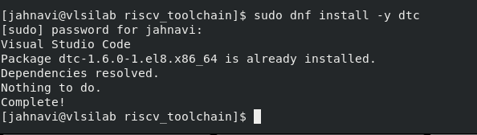

### Step3: Install spike and add to path
Spike is an open-source RISC-V Instruction Set Simulator (ISS) which is used to emulate the RISC-V programs without the requirement of physical hardware. The following commands are needed to be followed for installing spike:

```bash
cd ~/riscv_toolchain
git clone https://github.com/riscv/riscv-isa-sim.git
cd riscv-isa-sim
mkdir build
cd build
../configure --prefix=/home/jahnavi/riscv_toolchain/spike
make -j$(nproc)
make install
```

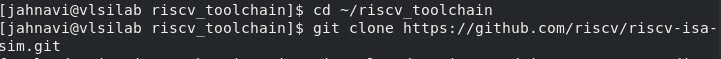 

*Since all these commands were exceuted together, screenshot could not be taken.*

Similar to what we did for GCC we need to add the spike to path. The command is:

```bash
export PATH=/home/jahnavi/riscv_toolchain/spike/bin:$PATH
echo 'export PATH=/home/jahnavi/riscv_toolchain/spike/bin:$PATH' >> ~/.bashrc
source ~/.bashrc
```
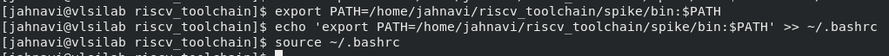

Sanity check for spike:
```bash
which spike
```
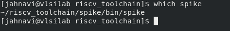

Spike help menu: 
```bash
spike -h
```
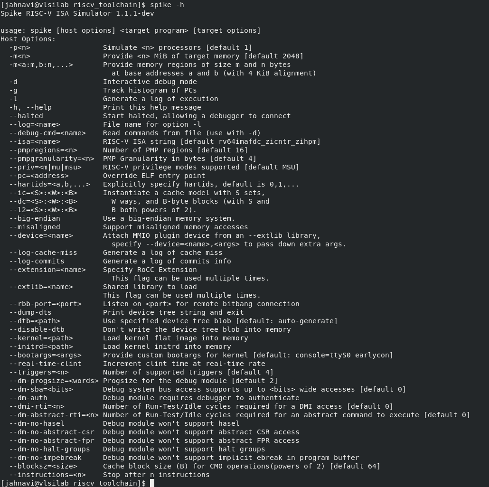

### Step4: Install pk and add to path
Proxy kernal or pk is the kind of operating system which enables the executions in a system without an operating system. Here since we are working on RISC-V architecture, we need to install pk which will help us to execute the programs in the system. 
The following is the installation commands:

```bash
cd ~/riscv_toolchain
git clone https://github.com/riscv/riscv-pk
cd riscv-pk
mkdir build
cd build
../configure --prefix=/home/jahnavi/riscv_toolchain/pk --host=riscv-none-elf CC="riscv-none-elf-gcc -march=rv64ima_zicsr_zifencei -mabi=lp64 -DMEM_START=0x80000000" CXX="riscv-none-elf-g++ -march=rv64ima_zicsr_zifencei -mabi=lp64 -DMEM_START=0x80000000" LD="riscv-none-elf-ld"
make -j$(nproc)
make install
```
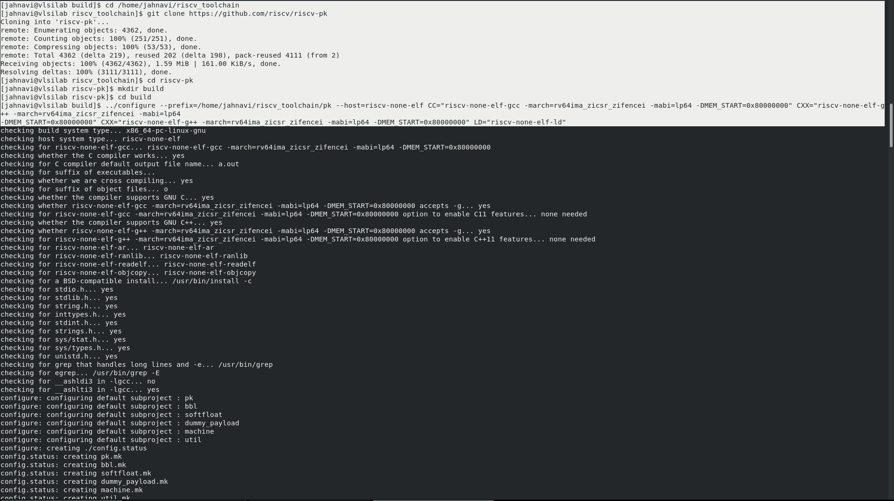

Here also we need to add to path:

```bash
export PATH=/home/jahnavi/riscv_toolchain/pk/riscv-none-elf/bin:$PATH
echo 'export PATH=/home/jahnavi/riscv_toolchain/pk/riscv-none-elf/bin:$PATH' >> ~/.bashrc
source ~/.bashrc
```

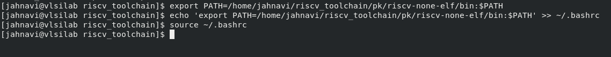

Sanity check for pk:
```bash
which pk
```
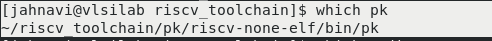

### Step5: Sanity checks
Finally checking if everything is installed properly or not:
```bash
which riscv-none-elf-gcc
which spike
which pk
```
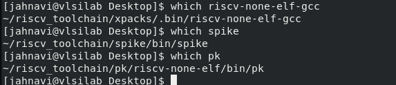

The final .bashrc file will look like this:

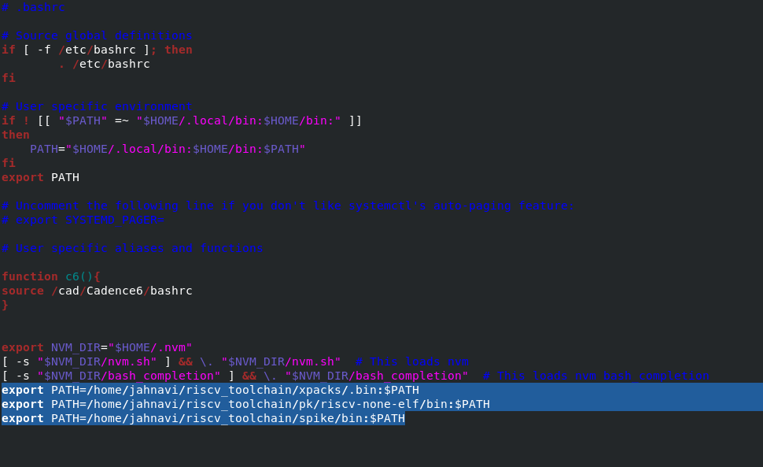

The final folder riscv_toolchain:
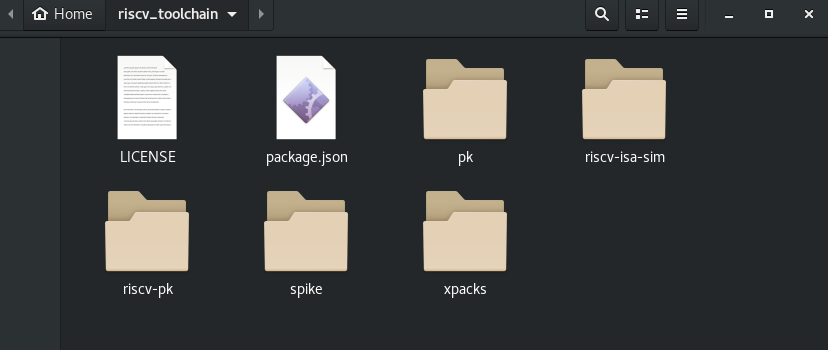


## Uniqueness Test

A program to give the 64‐bit FNV‐1a hash of username and hostname. 

### Program: 
The .c program is made to take the username and hostname as input and give the hash value as output. 


### Compilation command:
```bash
riscv-none-elf-gcc -O2 -Wall -march=rv64ima -mabi=lp64 -DUSERNAME=\"Jahnavi\" -DHOSTNAME=\"VLSILab\" unique_test.c -o unique_test
```
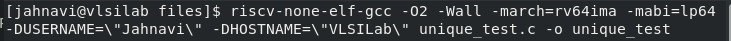

### Running on spike with pk
Here, we were getting an error which was resolved when you are giving the pk path

Command:
```bash
spike /home/jahnavi/riscv_toolchain/pk/riscv-none-elf/bin/pk ./unique_test
```
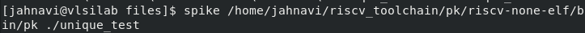

Output: 
```
RISC-V Uniqueness Check 
User: Jahnavi
Host: VLSILab
UniqueID: 0x69b7e1cc91ae1a87
GCC_VLEN: 6
```


## Errors encountered during the installation 

### Building directly from source instead of prebuilt file
This is a time consuming process, also too many unresolvable errors occured. one of them is given below: 
```bash
git submodule update --init --recursive

error: Server does not allow request for unadvertised object 935a51f3c66ece357ce0d18f3aa3627a13cef7d5

fatal: Fetched in submodule path 'dejagnu', but it did not contain 935a51f3c66ece357ce0d18f3aa3627a13cef7d5. Direct fetching of that commit failed. 
```
I tried to resolve the errors for the longest time at last switched to prebuilt tools, which are comparitively easy to install. Also I was able to find the latest version in the prebuilt tools. The latest version automatically resolves compatibility issues with spike and pk that might later occur during execution. 

### Error during installation of pk
```bash
which pk
/usr/bin/which: no pk in (/home/jahnavi/riscv_toolchain/riscv64-unknown-elf-gcc-8.3.0-2019.08.0-x86_64-linux-centos6/riscv64-unknown-elf/bin:/home/jahnavi/riscv_toolchain/pk/bin:/home/jahnavi/riscv_toolchain/spike/bin:/home/jahnavi/riscv_toolchain/riscv64-unknown-elf-gcc-8.3.0-2019.08.0-x86_64-linux-centos6/bin:/home/jahnavi/riscv_toolchain/riscv64-unknown-elf-gcc-8.3.0-2019.08.0-x86_64-linux-centos6/riscv64-unknown-elf/bin:/home/jahnavi/riscv_toolchain/pk/bin:/home/jahnavi/riscv_toolchain/spike/bin:/home/jahnavi/riscv_toolchain/riscv64-unknown-elf-gcc-8.3.0-2019.08.0-x86_64-linux-centos6/bin:/home/jahnavi/riscv_toolchain/pk/bin:/home/jahnavi/riscv_toolchain/spike/bin:/home/jahnavi/riscv_toolchain/riscv64-unknown-elf-gcc-8.3.0-2019.08.0-x86_64-linux-centos6/bin:/home/jahnavi/riscv_toolchain/riscv64-unknown-elf-gcc-8.3.0-2019.08.0-x86_64-linux-centos6/bin:/home/jahnavi/riscv_toolchain/spike/bin:/home/jahnavi/riscv_toolchain/riscv64-unknown-elf-gcc-8.3.0-2019.08.0-x86_64-linux-centos6/bin:/home/jahnavi/.local/bin:/home/jahnavi/bin:/usr/local/bin:/usr/local/sbin:/usr/bin:/usr/sbin:/var/lib/snapd/snap/bin)
```
The bin folder along with include and library folder was actually in pk/riscv64-unknown-elf/ and the search was happening in pk/bin. Therefore just change in path name while exporting the path will resolve the issue.

*Note: this error occurred when I am initailly trying to install  https://static.dev.sifive.com/dev-tools/riscv64-unknown-elf-gcc-8.3.0-2019.08.0-x86_64-linux-centos6.tar.gz for Alma Linux. However, I switched to xpack for getting the latest version, where I prevented this error from happening by using the exact export path*

### Path error for pk
```bash
spike pk ./unique_test
terminate called after throwing an instance of 'std::runtime_error'
  what():  could not open pk; searched paths:
	. (current directory)
	/home/jahnavi/riscv_toolchain/spike/riscv64-unknown-elf/bin/ (based on configured --prefix and --with-target)
```
The search for pk is happening only in the current directory where pk is not there, therefore add pk path while executing. 
```bash
spike /home/jahnavi/riscv_toolchain/pk/riscv-none-elf/bin/pk ./unique_test
```

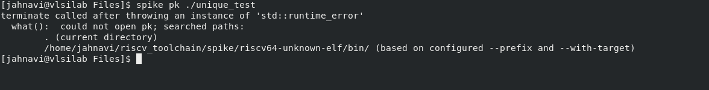

### Compilation Error
```bash
[jahnavi@vlsilab riscv_toolchain]$ riscv-none-elf-gcc -O2 -Wall -march=rv64ima -mabi=lp64 -DUSERNAME=\"Jahnavi\" -DHOSTNAME=\"VLSILab\" unique_test.c -o unique_test
cc1: fatal error: unique_test.c: No such file or directory
compilation terminated.
```
The compilation should be done by opening the terminal in the location where the c file is stored. Any other location will give this error. 

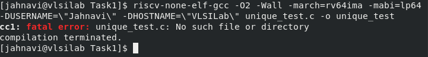

Error resolved by opening the right location
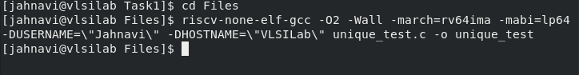


