# Task 2 - Prove Your Local RISC-V Setup (Run, Disassemble,Decode)

## End Goal: 
Running some RISC-V C programs on my local machine (complied with local toolchain, executed with spike pk) and then geneate the assembly code, decode the RISC-V instructions for each program. 
Print the machnie username, hostname, machine iD and timestamps to ensure that the output is unique to my machine. 

## Spike Version used
To check the spike version, go to the command prompt from any folder in your PC and type the following command: 
```bash
spike -h 
```

The first line will print your version details. 
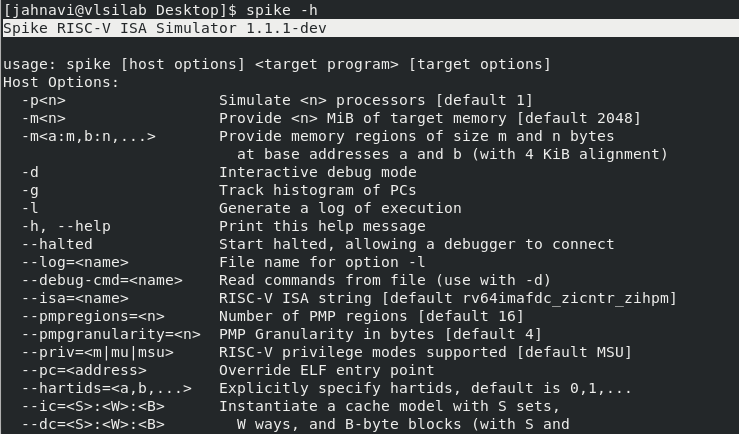

## Uniqueness mechanism 
To ensure that each build is machine and user specific, we can print the identity details in the start of every program. For this, we will save these details in some variables using the following command: 
This needs to be executed only once before executing all the programs. Then while compilation of the programs, pass these values. 

```bash
export U=$(id -un)
export H=$(hostname -s)
export M=$(cat /etc/machine-id | head -c 16)
export T=$(date -u +%Y-%m-%dT%H:%M:%SZ)
export E=$(date +%s)
```
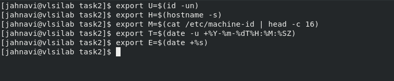

Then create the following file in the folder where you are keeping all the programs for execution and save it with '.h' extension (which means we made a header file). 
This program will print all the details from above. We will include this program in every other programs executed in this task. 


It should be noted that this header files includes all the other commonly used and required (in our program) headers, so we don't need to call them separately in each program. Just including this file is enough. 
It includes the following common headers: 

```bash
#include <stdio.h>
#include <stdint.h>
#include <time.h>
```
## Programs implemented

### Factorial 

Program code (.c file): 

#### Compilation command

```bash
riscv-none-elf-gcc -O0 -g -march=rv64ima -mabi=lp64 -DUSERNAME="\"$U\"" -DHOSTNAME="\"$H\"" -DMACHINE_ID="\"$M\"" -DBUILD_UTC="\"$T\"" -DBUILD_EPOCH=$E \factorial.c -o factorial
```
After entering this command, an executable file will be formed in your folder.

#### Execution command

```bash
spike /home/jahnavi/riscv_toolchain/pk/riscv-none-elf/bin/pk ./factorial
```

**Output**

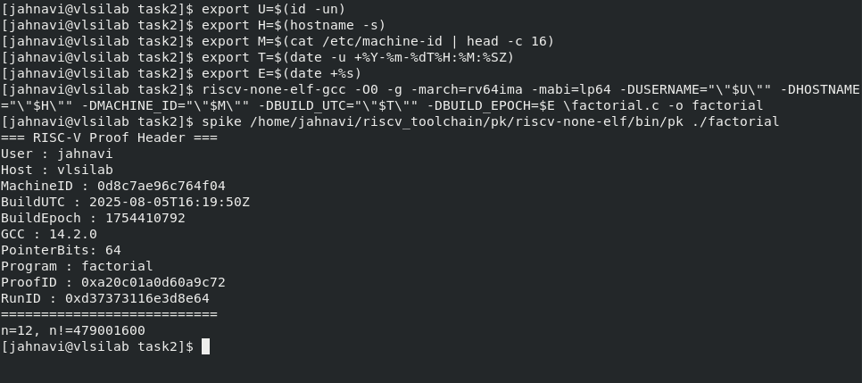

#### Creating assembly file (.s)

```bash
riscv-none-elf-gcc -O0 -S factorial.c -o factorial.s
```

This will create the following file: 

#### Creating the disassembly file of main only (.txt)

```bash
riscv-none-elf-objdump -d ./factorial | sed -n '/<main>:/,/^$/p' | tee factorial_main_objdump.txt
```

This will create the following file: 


**Output**

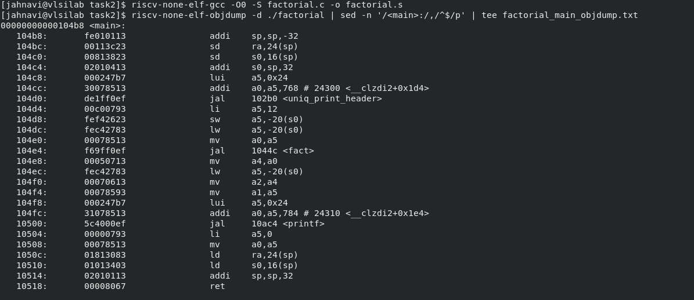


#### After executing all the above commands, the following files should be available in your folder:

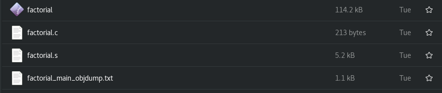


### Max Array
Program code (.c file): 

#### Compilation command

```bash
riscv-none-elf-gcc -O0 -g -march=rv64ima -mabi=lp64 -DUSERNAME="\"$U\"" -DHOSTNAME="\"$H\"" -DMACHINE_ID="\"$M\"" -DBUILD_UTC="\"$T\"" -DBUILD_EPOCH=$E max_array.c -o max_array
```
After entering this command, an executable file will be formed in your folder.

#### Execution command

```bash
spike /home/jahnavi/riscv_toolchain/pk/riscv-none-elf/bin/pk ./max_array
```

**Output**

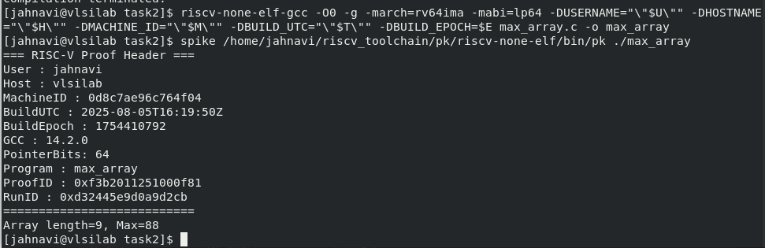

#### Creating assembly file (.s)

```bash
riscv-none-elf-gcc -O0 -S max_array.c -o max_array.s
```
This will create the following file: 

#### Creating the disassembly file of main only (.txt)

```bash
riscv-none-elf-objdump -d ./max_array | sed -n '/<main>:/,/^$/p' | tee max_array_main_objdump.txt
```
This will create the following file: 


**Output**

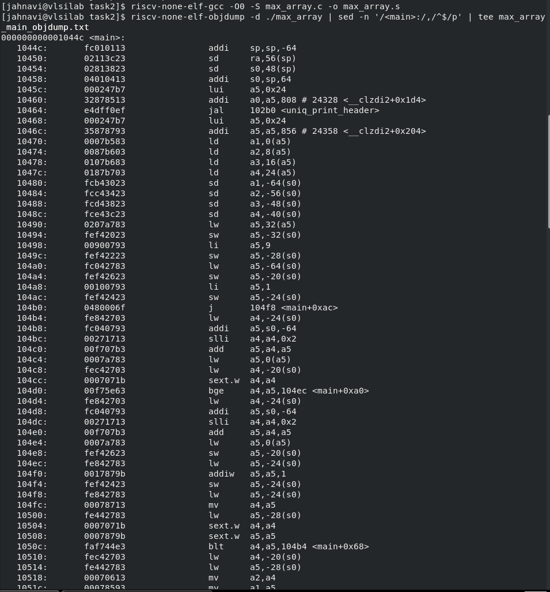


#### After executing all the above commands, the following files should be available in your folder:

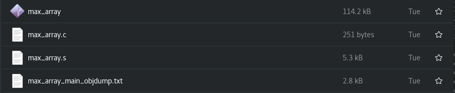


### Bitops

Program code (.c file): 

#### Compilation command

```bash
riscv-none-elf-gcc -O0 -g -march=rv64ima -mabi=lp64 -DUSERNAME="\"$U\"" -DHOSTNAME="\"$H\"" -DMACHINE_ID="\"$M\"" -DBUILD_UTC="\"$T\"" -DBUILD_EPOCH=$E bitops.c -o bitops
```

After entering this command, an executable file will be formed in your folder.

#### Execution command

```bash
spike /home/jahnavi/riscv_toolchain/pk/riscv-none-elf/bin/pk ./bitops
```
**Output**

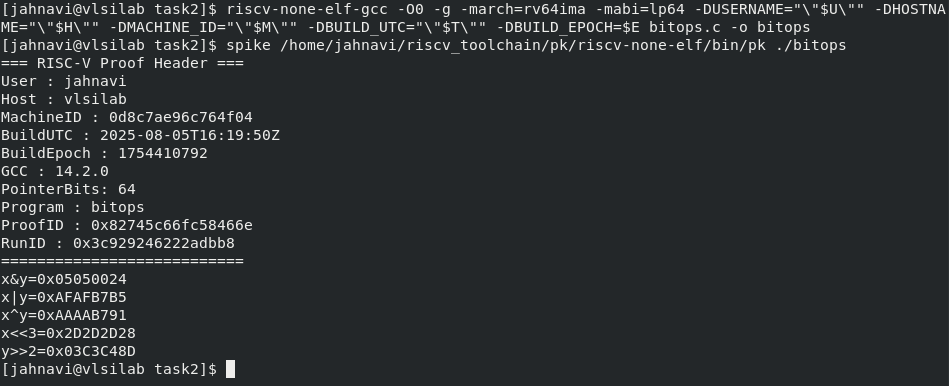

#### Creating assembly file (.s)

```bash
riscv-none-elf-gcc -O0 -S bitops.c -o bitops.s
```
This will create the following file: 

#### Creating the disassembly file of main only (.txt)

```bash
riscv-none-elf-objdump -d ./bitops | sed -n '/<main>:/,/^$/p' | tee bitops_main_objdump.txt
```
This will create the following file: 

**Output**

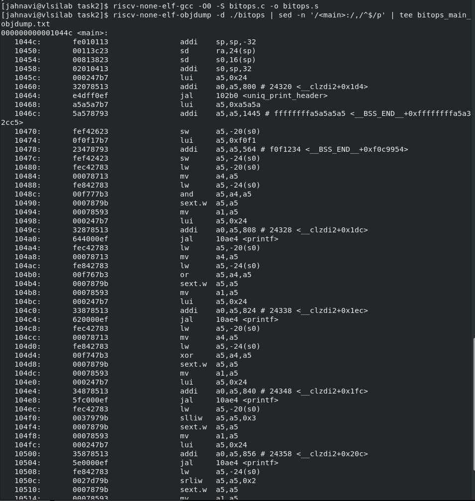


#### After executing all the above commands, the following files should be available in your folder:

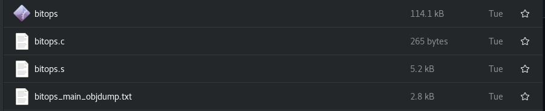

### Bubble sort

Program code (.c file): 

#### Compilation command

```bash
riscv-none-elf-gcc -O0 -g -march=rv64ima -mabi=lp64 -DUSERNAME="\"$U\"" -DHOSTNAME="\"$H\"" -DMACHINE_ID="\"$M\"" -DBUILD_UTC="\"$T\"" -DBUILD_EPOCH=$E bubble_sort.c -o bubble_sort
```
After entering this command, an executable file will be formed in your folder.

#### Execution command

```bash
spike /home/jahnavi/riscv_toolchain/pk/riscv-none-elf/bin/pk ./bubble_sort
```
**Output**

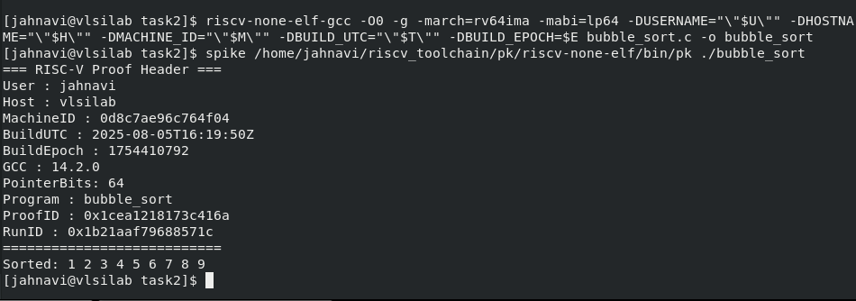

#### Creating assembly file (.s)

```bash
riscv-none-elf-gcc -O0 -S bubble_sort.c -o bubble_sort.s
```
This will create the following file: 

#### Creating the disassembly file of main only (.txt)

```bash
riscv-none-elf-objdump -d ./bubble_sort | sed -n '/<main>:/,/^$/p' | tee bubble_sort_main_objdump.txt
```
This will create the following file: 


**Output**

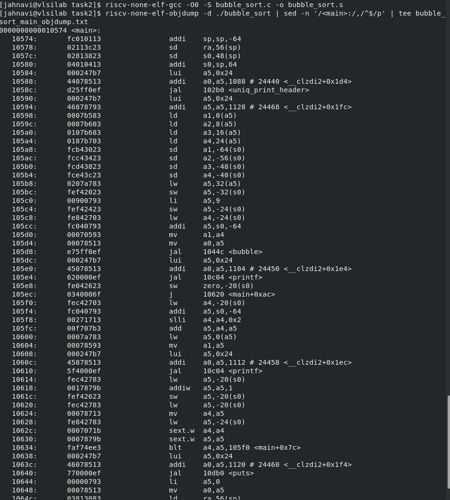


#### After executing all the above commands, the following files should be available in your folder:

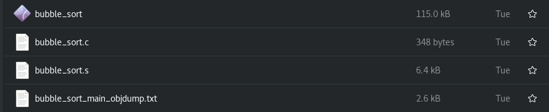

## After executing all the above programs your final folder will look like this

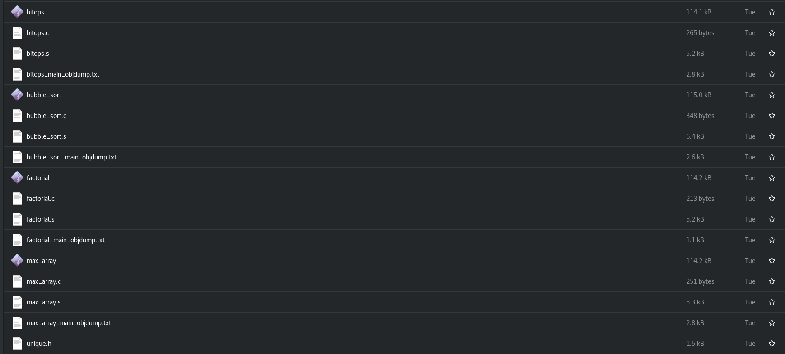

## Decoding the assembly code

Basically trying to understand the assembly code instructions of RISC-V architecture. 

For this take the instructions from the disassembly file (<*program name*>_objdump.txt) file of any program and take the instructions. 

Convert the instruction hex vale to binary. And check the RISC-V datasheet:  to decode the instruction. 

 |No.|Instruction       |Opcode |rd  |rs1 |rs2 |funct3|funct7   |Binary         |Description    |
 |:-:|:----------------:|:-----:|:--:|:--:|:--:|:----:|:------:|:--------------:|:------------:|
 |1  |addi s0,sp,32     |0010011|x8  | x2 |---| 000  |--------|00000010000000010000010000010011|s0 = sp + 32 |
 |2  |mv a4,a5          |0010011|x14 |x15 |---| 000  |--------|00000000000001111000011100010011|Psuedo Inst. Copy a5 to a4|
 |3  |xor	a5,a4,a5      |0110011|x15 |x14 |x15 | 100  |00000000|00000000111101110100011110110011|a5 = a4 ˆ a5|
 |4  |lw a5,-20(s0)     |0000011|x15 |x8  |---| 010  |--------|11111110110001000010011110000011|a5 = M[s0-20] |
 |5  |sw a5,-24(s0)     |0100011|----|x8|x15| 010 |--------|11111110111101000010010000100011| M[s0-24] = a5|
 |6  |jal 10ae4 <printf>|1101111|x1|---|---|---|--------|01011110000000000000000011101111| Jump to dest address (10ae4) where printf is located by adding immediate value (5E) to PC value (PC + 5E = 10ae4). Stores next inst. address in ra register |

 ### Notes:
 Each instruction has some type (like R, I, J etc) which is given in the start of the datasheet. Each type has one addressing format that needs to be used for decoding. 

 The end of that document gives the actual register names
